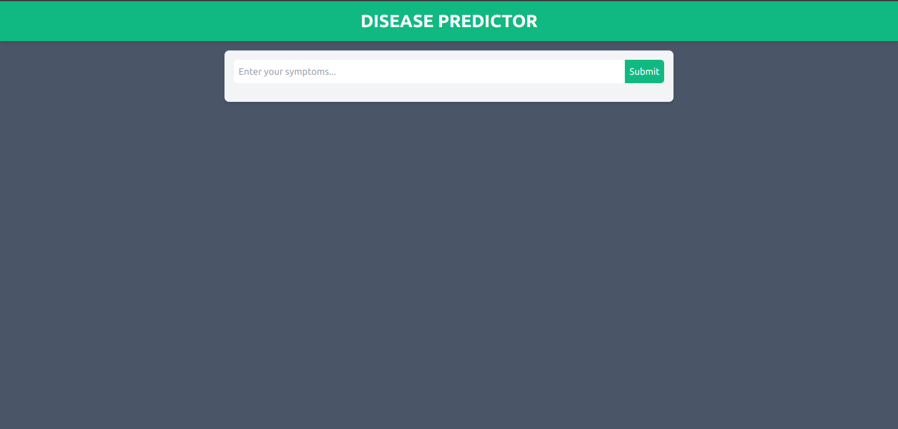
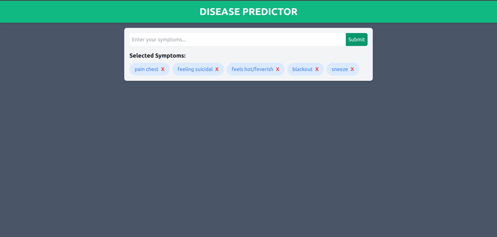
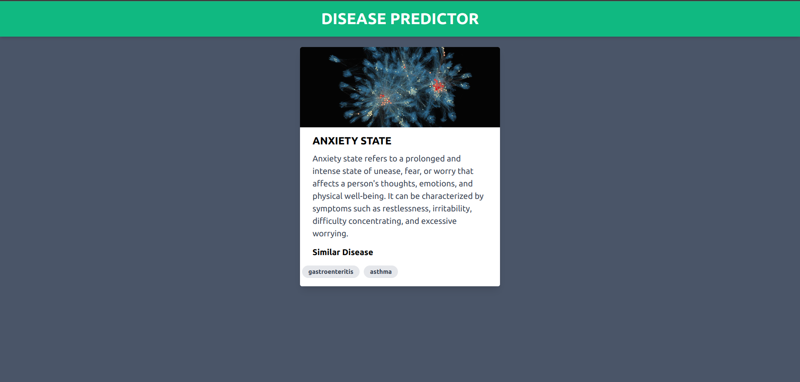

# MODERN DISEASE PREDICTOR WITH CHATGPT

## Overview
The Machine Learning Disease Prediction Web App is a comprehensive health platform developed using React and Vite for the front end, and Flask for the backend. The primary objective is to provide users with an intelligent and user-friendly interface for predicting potential diseases based on input symptoms.

[View Website](https://moderndiseasedetector.onrender.com/)

## Key Features

 **Technology Stack:**
- **Frontend:** Developed using React and Vite, ensuring a responsive and modern user interface.
- **Backend:** Powered by Flask, a lightweight yet robust web framework for Python.

**Machine Learning Integration:**
- The heart of the application lies in its machine learning algorithms. By leveraging p

**ChatGPT Integration:**
- To enhance user interaction and understanding, the app integrates ChatGPT. Users can engage in a chat-like conversation to learn more about the predicted disease and gain a brief overview of its characteristics.

## How It Works:

**User Input:**
   - Users provide their symptoms through an intuitive interface.

**Machine Learning Prediction:**
   - The app processes the symptoms using machine learning algorithms, predicting potential diseases based on historical data and patterns.

**ChatGPT Interaction:**
   - For a more insightful experience, users can engage in a conversation with ChatGPT to gather additional information and insights about the predicted disease.

## Benefits:

**User-Friendly Interface:**
   - The web app offers a seamless and user-friendly experience, ensuring accessibility for individuals with varying technical expertise.

**Educational Interaction:**
   - By integrating ChatGPT, the app not only predicts diseases but also educates users about them, fostering a better understanding of their health.

**Responsive Design:**
   - The use of React and Vite ensures a responsive design, making the app accessible across various devices and screen sizes.

## In Conclusion:

The Machine Learning Disease Prediction Web App is not just a diagnostic tool; it's a holistic health companion that empowers users with insights, educational content, and a user-friendly interface for better health management.

## Images

